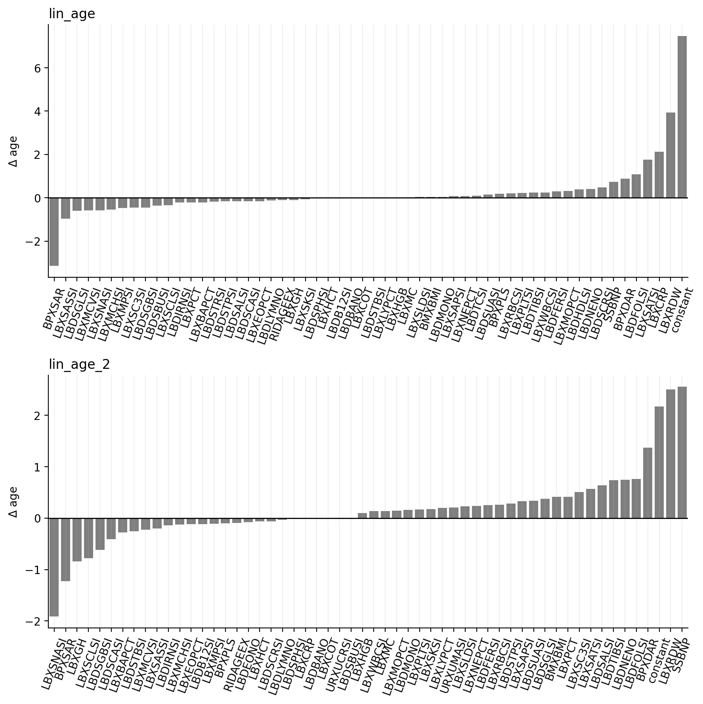

```python
import pandas as pd
import seaborn as sns
import matplotlib.pyplot as plt

from calculator import calculate

# Load example data.
data = pd.read_csv('example_user.csv')
data = dict(zip(data['biomarker'],data['value']))

# Run calculator.
results = calculate(data)

# Print results.
print(f"age       = {results['age']:.2f} years")
print(f"lin_age   = {results['lin_age']:.2f} years")
print(f"lin_age_2 = {results['lin_age_2']:.2f} years")

```

    age       = 77.17 years
    lin_age   = 88.23 years
    lin_age_2 = 86.47 years


```python
# Print contribution of each biomarker to delta-age.

fig, ax = plt.subplots(2, 1, figsize=(9, 9))

for idx, model in enumerate(['lin_age','lin_age_2']):

    weights = results[f'{model}__contributions'].sort_values().dropna()

    sns.barplot(weights, orient='v', ax=ax[idx], color='tab:gray')
    sns.despine()

    ax[idx].set_ylabel('$\Delta$ age')
    ax[idx].tick_params(axis='x', rotation=70)
    ax[idx].axhline(0, color='k', lw=1)
    ax[idx].grid(linestyle='-', axis='x', alpha=.2)
    ax[idx].set_title(model, loc='left')


plt.tight_layout()
```


    

    


```python
# See model files for expected units and biomarker names:
for model in ['lin_age','lin_age_2']:

    print(f'{model}:')
    df_model = pd.read_csv(f'models/{model}.csv')
    display(df_model[['biomarker','description']])

```

    lin_age:


<div>
<style scoped>
    .dataframe tbody tr th:only-of-type {
        vertical-align: middle;
    }

    .dataframe tbody tr th {
        vertical-align: top;
    }

    .dataframe thead th {
        text-align: right;
    }
</style>
<table border="1" class="dataframe">
  <thead>
    <tr style="text-align: right;">
      <th></th>
      <th>biomarker</th>
      <th>description</th>
    </tr>
  </thead>
  <tbody>
    <tr>
      <th>0</th>
      <td>BPXPLS</td>
      <td>Pulse (30 second pulse x 2)</td>
    </tr>
    <tr>
      <th>1</th>
      <td>BPXSAR</td>
      <td>Systolic blood pressure average (mmHg)</td>
    </tr>
    <tr>
      <th>2</th>
      <td>BPXDAR</td>
      <td>Diastolic blood pressure average (mmHg)</td>
    </tr>
    <tr>
      <th>3</th>
      <td>BMXBMI</td>
      <td>Body mass index (kg/m2)</td>
    </tr>
    <tr>
      <th>4</th>
      <td>LBDIRNSI</td>
      <td>Iron (umol/L)</td>
    </tr>
    <tr>
      <th>...</th>
      <td>...</td>
      <td>...</td>
    </tr>
    <tr>
      <th>58</th>
      <td>fs3Score</td>
      <td>Healthcare use index</td>
    </tr>
    <tr>
      <th>59</th>
      <td>LDLV</td>
      <td>Low-density lipoprotein (mmol/L)</td>
    </tr>
    <tr>
      <th>60</th>
      <td>crAlbRat</td>
      <td>Urine albumin-to-creatinine ratio (mg/g)</td>
    </tr>
    <tr>
      <th>61</th>
      <td>RIDAGEEX</td>
      <td>Chronological age (months)</td>
    </tr>
    <tr>
      <th>62</th>
      <td>constant</td>
      <td>C0 Constant</td>
    </tr>
  </tbody>
</table>
<p>63 rows × 2 columns</p>
</div>


    lin_age_2:


<div>
<style scoped>
    .dataframe tbody tr th:only-of-type {
        vertical-align: middle;
    }

    .dataframe tbody tr th {
        vertical-align: top;
    }

    .dataframe thead th {
        text-align: right;
    }
</style>
<table border="1" class="dataframe">
  <thead>
    <tr style="text-align: right;">
      <th></th>
      <th>biomarker</th>
      <th>description</th>
    </tr>
  </thead>
  <tbody>
    <tr>
      <th>0</th>
      <td>RIDAGEEX</td>
      <td>Chronological Age (months)</td>
    </tr>
    <tr>
      <th>1</th>
      <td>BMXBMI</td>
      <td>Log Body Mass Index (kg/m2)</td>
    </tr>
    <tr>
      <th>2</th>
      <td>BPXSAR</td>
      <td>Systolic Blood Pressure (mmHg)</td>
    </tr>
    <tr>
      <th>3</th>
      <td>BPXDAR</td>
      <td>Diastolic Blood Pressure (mmHg)</td>
    </tr>
    <tr>
      <th>4</th>
      <td>BPXPLS</td>
      <td>Pulse Rate (bpm)</td>
    </tr>
    <tr>
      <th>...</th>
      <td>...</td>
      <td>...</td>
    </tr>
    <tr>
      <th>56</th>
      <td>LBXCOT</td>
      <td>Smoking status / Cotinine (ng/mL)</td>
    </tr>
    <tr>
      <th>57</th>
      <td>fs1Score</td>
      <td>Co-morbidity index</td>
    </tr>
    <tr>
      <th>58</th>
      <td>fs2Score</td>
      <td>Self-health index</td>
    </tr>
    <tr>
      <th>59</th>
      <td>fs3Score</td>
      <td>Healthcare use index</td>
    </tr>
    <tr>
      <th>60</th>
      <td>constant</td>
      <td>C0 Constant</td>
    </tr>
  </tbody>
</table>
<p>61 rows × 2 columns</p>
</div>

